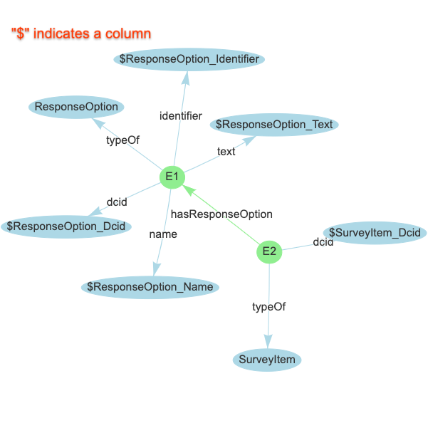
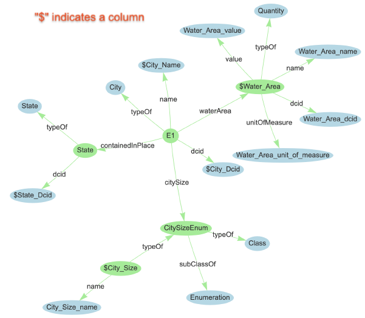

# Meta Content Framework (MCF) in Data Commons

## Background

Data Commons accepts graph data in multiple formats. In addition to web
standards like JSON-LD and RDFa, we also make heavy use of an earlier format
called MCF. We use this simple format extensively because of its easy
readability. This page documents MCF.

Data Commons is a directed labeled graph. The nodes in this graph are either
'entities' or primitive data types (strings and numbers). Each arc has a label,
which we will often refer to as a property. This is the basis of the
[Schema.org Data Model](https://schema.org/docs/datamodel.html), as well as
ours. It is also worth noting that the Data Commons schema is a superset of
Schema.org.

## MCF Format

An MCF file consists of one or more blocks, each corresponding to an entity. A
block looks like this:

```
Node: <identifier>
<property>: <value>, <value>
```

The identifier is a unique identifier for that entity (more on the scope of the
identifier below) and is used to refer to that entity. The following lines each
specify a property and one or more values, separated by commas. Each value can
be a reference to another entity (via its identifier), a string (enclosed by
double quotes) or a number. For example:

```
Node: Test1
typeOf: TestNode
child: Test2, Test3
name: "I am a test node"
itemCode: 42

Node: Test2
typeOf: TestNode
sibling: Test3
name: "I am another test node in a test world"

Node: Test3
typeOf: TestNode
sibling: Test2
name: "Just another test node in a test world"
```

> NOTE:
>
> *   The identifier must not include a comma (`,`) and must not be enclosed
>     within double quotes.
> *   A common parsing failure is due to odd number of unescaped double quotes
>     in text. For instance, `"foo bar" baz"` needs to be `"foo bar\" baz"`.
> *   Commas within double quotes are not considered as value separators.
> *   Every entity has at least one property: `typeOf`.

### Scoping and Namespaces

The Data Commons graph is built from data that is distributed across many files,
from different sources. One challenge is coordination and scoping of identifiers
across multiple sources. We adopt the solution that has been used before in the
context of programming languages, XML, etc.: **namespaces**.

Each MCF file includes a `Context` section whose scope is that file. Context
includes the provenance (`importName`, `importUrl`, `provenanceUrl`) that the
MCF file is part of, and namespace definitions. When multiple MCF files are
associated with a provenance, the same `Context` section needs to be repeated in
each file.

Contexts are declared at the top of the MCF file as follows:

```
Context:
importName: "UnicefDataset"
importUrl: "https://www.boborg.org/unicef_dataset.mcf"
provenanceUrl: "http://www.unicef.org"
namespace: "dc=http://dublincore.org"
namespace: "foaf=http://xmlns.com/foaf/0.1/"
```

To refer to an entity via its identifier (`id1`) in a namespace associated with
a prefix 'foaf', we write 'foaf:id1'. To refer to an entity via its identifier
in the local namespace, we use the prefix `l`.

#### Special Namespaces

The Data Commons graph is built on top of Schema.org vocabulary and its Data
Commons extensions. To facilitate references to terms from these schemas, the
prefixes `schema` and `dcs` are reserved for these vocabularies.

The default prefix associated with properties is `schema` or `dcs`.

Data Commons assigns a unique identifier to each entity. This identifier is the
value of the property 'dcid'. `dcid` can also be used as the prefix to refer to
entities by their Data Commons ID (DCID).

#### Namespace Summary

**Namespaces are used for references.** Here are the types of references:

*   Curator reference: `<prefix-string>:` prefix
*   Local ID reference: `l:` prefix
*   Schema.org schema reference: `schema:` prefix
*   Data Commons schema addition reference: `dcs:` prefix
*   DCID reference: `dcid:` prefix

The last three are functionally identical, and the difference exists only as
matter of convention. Differentiating curator and local ID reference from the
rest is important. We will attempt to resolve curator and local IDs into
corresponding DCIDs, while for the last three, we won't.

#### Referencing Examples

Here are MCF nodes for a city, county, and state, demonstrating usage of local
ID, DCID, Schema.org schema, and Data Commons schema referencing:

```
Node: USCity_0600001
typeOf: schema:City
dcid: "geoId/0600001"
name: "No Place Town"
containedInPlace: l:USCounty_06085, l:USState_06

Node: USCounty_06085
typeOf: dcs:County
dcid: "geoId/06085"
name: "Santa Clara County"
containedInPlace: l:USState_06

Node: USState_06
typeOf: schema:State
dcid: "geoId/06"
name: "California"
containedInPlace: dcid:country/USA
```

NOTE: The value of the `dcid` property is a double-quoted string that does *not*
include the `dcid:` prefix (for example, `dcid: "geoId/06"`). In contrast,
property values that represent resolved references to other nodes are not
strings and include a `dcid:` prefix (for example, `containedInPlace:
dcid:country/USA`).

### Relaxed Syntax

The syntax described so far has been slightly simplified as follows to be less
demanding, and more accomodative of common typos. Note that following the
stricter syntax described above does work.

#### Skip global prefix on known ref properties

For well-known properties that are known to have referencess as values, the
global reference prefixes (`dcs:`, `schema:`, `dcid:`) for their values can be
dropped.

Reference properties include: `location`, `observedNode`, `containedInPlace`,
`typeOf`, `populationType`, `subClassOf`, `rangeIncludes`, `domainIncludes`,
`measuredProperty`, `constraintProperties`, `measurementMethod`.

NOTE: Never ever drop the local ID prefix `l:`. Otherwise we risk ingesting
orphan refs.

For example:

```
Node: USCity_0600001
typeOf: City
dcid: "geoId/0600001"
name: "No Place Town"
containedInPlace: l:USState_06

Node: USState_06
typeOf: State
dcid: "geoId/06"
name: "California"
containedInPlace: country/USA
```

Note that the `l:` in `l:USState_06` is still required, while `schema:City` has
become `City`, etc.

#### Use DCID ref as node name.

This is a more succinct way of writing the node MCF, to avoid assigning a node
name and a DCID.

For example:

```
Node: dcid:geoId/0600001
typeOf: Place, City
name: No Place Town
containedInPlace: geoId/06

Node: dcid:geoId/06
typeOf: State
name: California
containedInPlace: country/USA
```

Note: When DCID appears in the Node name, the `dcid:` prefix is required. If
missing, we would intepret it as a local ID.

### Misc.

#### Entities with properties coming from different datasets

If you have entities that have properties coming from multiple datasets, each
dataset should write a MCF node for the entity with just the properties it
determines.

For example:

```
# From first dataset
Node: dcid:geoId/06
typeOf: State
name: California
containedInPlace: country/USA
```

```
# From another dataset with motto information
Node: dcid:geoId/06
typeOf: State
motto: "Eureka"
```

As long as each MCF node unambiguously refers to the same entity, once injested,
the entity corresponding to `geoId/06` will have all the properties: `typeOf`,
`name`, `containedInPlace`, and `motto`.

#### Leaving comments in MCF

Comments are allowed on new lines, but trailing comments are not supported.

For example:

```
# This is an OK comment-line!
Node: dcid:geoId/0600001
typeOf: City  # But trailing comments like this are not allowed.
name: No Place Town
containedInPlace: geoId/06
```

#### DCID and Name Conventions

-   For non-schema entities, do not use underscores in identifier or DCID
    fields.

-   For classes, the DCID and name must follow PascalCasing. This means first
    letter is upper-cased.
    [(EXAMPLE)](https://browser.datacommons.org/kg?dcid=BiologicalSpecimen)

-   For properties, the DCID and name must follow camelCasing. This means first
    letter is lower-cased.
    [(EXAMPLE)](https://browser.datacommons.org/kg?dcid=healthOutcome)

-   DCIDs have a length limit of 256 characters. Nodes with a DCID longer than
    256 characters will throw a syntax error upon uploading to DataCommons.

## MCF Types in Data Commons

We employ two main types of MCF nodes: instance MCF and template MCF. We may
also refer to files of instance MCF nodes as "instance MCF"; likewise for
template MCF. The two types of MCF nodes are as of today, never present in the
same file.

### Instance MCF

Within instance MCF are two subtypes: data MCF and schema MCF. All the MCF nodes
seen in this doc thus far are data MCF (and therefore instance MCF)--they
describe a specific data point or entity. A schema MCF node describes a class,
enum, or property: they define schema that other MCF nodes use. For example:

```
Node: schema:State
typeOf: schema:Class
subClassOf: schema:Place
name: State
```

This is a schema MCF node because it defines a new class of entity `State` that
other nodes can be `typeOf`.

### Template MCF

Template MCF, or tMCF, is an intermediary MCF that we use for mapping datasets to instance
MCF. Template MCF does not get ingested into the Data Commons graph. They are
referencing the data in a paired .csv and together will be used to generate a
MCF that can be ingested into the graph.

For example, if we had a dataset `SomeDataset` stored as a .csv with columns:

`ResponseOption_Identifier, ResponseOption_Text, ResponseOption_Dcid,
ResponseOption_Name, SurveyItem_Dcid`

And you have defined a schema that looks like:



The template MCF looks like:

```
Node: E:SomeDataset->E1
typeOf: ResponseOption
dcid: C:SomeDataset->ResponseOption_Dcid
name: C:SomeDataset->ResponseOption_Name
identifier: C:SomeDataset->ResponseOption_Identifier
text: C:SomeDataset->ResponseOption_Text

Node: E:SomeDataset->E2
hasResponseOption: E:SomeDataset->E1
typeOf: SurveyItem
dcid: C:SomeDataset->SurveyItem_Dcid
```

Where "E" is short for "Entity" and "C" is short for "Column".

"E" should be used to refrence another entity that is defined in the template
MCF only. Instead "C" should be used to refer to property values that are 
entities already populated in the graph and not being defined in the template 
MCF. "C" should also be used to reference property values that are Quantities
or Enummerations already defined in the schema.

For example, if we had a dataset `SomeDataset` stored as a .csv with columns:

`State_Dcid, City_Dcid, City_Name, City_Size, Water_Area`

And you are referencing an existing node in the Data Commons graph with a
defined a schema that looks like:



The template MCF looks like:

Node: USCity_0600001
typeOf: City
dcid: "geoId/0600001"
name: "No Place Town"
containedInPlace: l:USState_06

```
Node: E:SomeDataset->E1
typeOf: City
dcid: C:SomeDataset->City_Dcid
name: C:SomeDataset->City_Name
containedInPlace C:SomeDataset->State_Dcid
waterArea: C:SomeDataset->Water_Area
citySize: C:SomeDataset->City_Size
```

Contributors need not worry about the process of using template MCF to convert
datasets to instance MCF, but roughly, for each row of the dataset, we create
all the nodes in the template MCF specification, substituting values from the
specified columns for each property.
