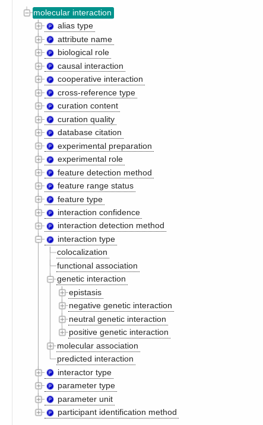
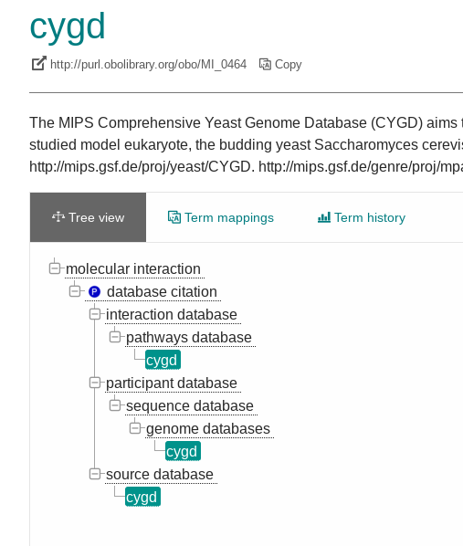
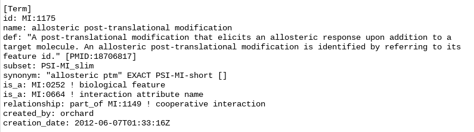

# Scripts for importing ontology dataset from the European Bioinformatics Institute (EMBL-EBI)

```
proteinInteractionEBI
│   README.md
│   parseEBI.ipynb
|   parseEBI.py
|   mi.owl
|   BioOntologySchema.mcf (contains all the schemas to be imported to KG)
|   handwrittenSchema.txt (contains only schema MCF)
│
└───graph
│   │   multipleParent.png
│   │   originalDataSample.png
│   │   ontologyTree.png

```

This directory stores all scripts used to import datasets from the European Bioinformatics Institute (EMBL-EBI). 
Here we only import the three subsets of the ontologies: "interaction detection method", "interaction type" and "database citation", which are commonly used in protein-protein interactions. 

## Database format

Data is available for download from
https://www.ebi.ac.uk/ols/ontologies/mi. 
The ontologies dictionary has a tree structure. Note here that one parent node can have multiple child nodes and one child node can have multiple parent nodes as well.





The original data file (mi.owl) uses "is_a" and "part_of" as the relation property to connect the child node to the parent node, however we don't distinguish these two and a property "specializationOf" is used for the child-parent connection.



We make each term as an enumeration node of three subtrees with root nodes as: "database citation", "interaction detection method", and "interaction type". There are two main concerns that we didn't import all the nodes. First, we focus on the ontologies in protein-protein interaction and these three categories are the most commonly used. Secondly, importing too many general terms may cause confusion in our Data Commons knowledge graph. 

We also left out the properties named "synonym", "subset", "created_by" and "creation_date" which contain the data that don't play important roles in our nodes of protein-protein interaction currently. If needed we will import these properties in the future. Property "identifier" of each enumeration instance contains a PSI-MI identifier. 


## Algorithm for parsing data file: mi.owl

### Parsing Steps

1. build the tree by the psi-mi number. A dictionary {psi-mi: node} is used to access nodes as well. 
2. nodes of three subtrees will be imported, and roots of the subtrees are:
- "id: MI:0001 name: interaction detection method" 
- "id: MI:0190 name: interaction type"  
- "id: MI:0444 name: database citation" 

  Depth-first search was run on each root to collect the node values separately.

3. save the nodes in the three sets to the corresponding enumeration schema

## Schema overview


### New Enumeration

InteractionTypeEnum, InteractionDetectionMethodEnum, InteractionSourceEnum.


