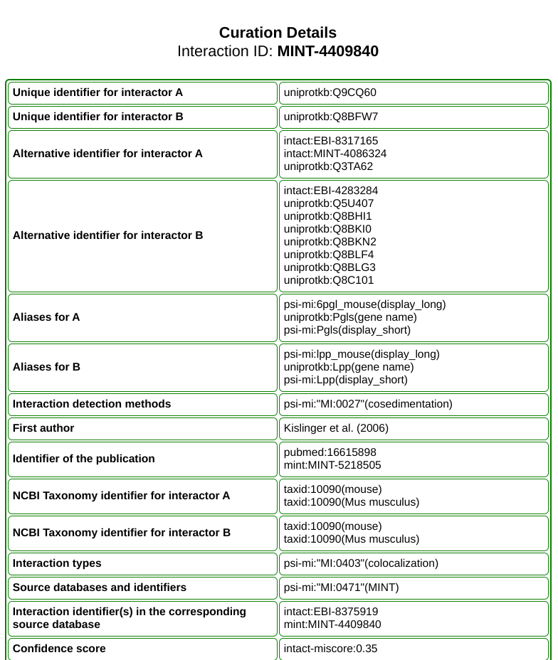

# Scripts for importing ontology dataset from the Molecular INTeraction database (MINT)

```
proteinInteractionEBI
│   README.md
│   parseMINT.ipynb
|   parseMINT.py
|   BioMINTSchema.mcf (contains schema MCF and part of instances to be imported to KG)
|   schemaMCF.txt (contains only schema MCF)
│
└───graph
│   │   MINTexample.png

```

This directory stores all scripts used to import datasets from the Molecular INTeraction database (MINT). MINT contains publicly available protein-protein interactions and uses the Molecular Interaction Ontology of the Proteomics Standard Initiative (PSI-MI).

## Database format

The data can be downloaded at https://mint.bio.uniroma2.it/index.php/download/ 

The downloaded data is tab-separated format.

The dataset contains information for the interaction and the participant proteins. A full interaction example from the website is https://mint.bio.uniroma2.it/index.php/detailed-curation/?id=MINT-4409840. The features of each participant such as "Biological role", "Interactor type" are not included in the downloadable database thus we didn't import these features to Data Commons. The information available in the downloadable database is shown in the graph below.  



A protein-protein interaction instance connects to partipant proteins through property "interactingProtein", connects to detection methods through property "interactionDetectionMethod", connects to interaction type through property "interactionType", connects to the source database through property "interactionSource", connects to related publications through property "references" and connects to related database records through property "identifier". The objects of "interactionType", "interactionDetectionMethod" and "interactionSource" are enumeration instances from EMBL-EBI Molecular Interaction Ontology database. The objects of "interactingProtein" are protein instances from UniPort.


## Schema overview


### New class

ProteinProteinInteraction.

### New properties

interactingProtein, interactionType, interactionSource.


## Reference

Licata, Luana, et al. "MINT, the molecular interaction database: 2012 update." Nucleic acids research 40.D1 (2012): D857-D861.
https://academic.oup.com/nar/article/40/D1/D857/2903552
